# DMVPN Fase 2 — IKEv1 con Enrutamiento Dinámico (EIGRP)

**Alumno:** Junior Javier Santos Perez  
**Matrícula:** 2024-1599  
**Plataforma:** Lab PNET  
**Fecha:** Junio 2026

## Videio demostrativo: ##

## Link GitHub: ##

---

## Objetivo

Implementar una VPN hub-and-spoke punto a multipunto usando **DMVPN Fase 2** con **IKEv1** como protocolo de negociación de claves y **EIGRP** como protocolo de enrutamiento dinámico.

La Fase 2 de DMVPN permite que los Spokes establezcan túneles **directos entre sí** (Spoke-to-Spoke) sin necesidad de que el tráfico pase por el Hub, mejorando la latencia y reduciendo la carga en el nodo central. IKEv1 gestiona la negociación de las asociaciones de seguridad en dos fases (Main Mode + Quick Mode).

---

## Topología

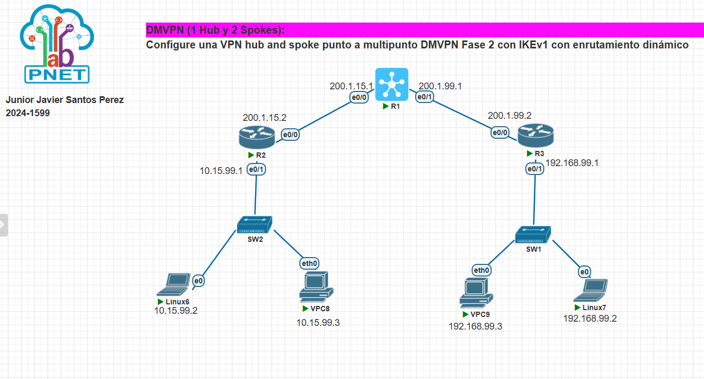

*IMAGEN1 — Topología general del laboratorio: R1 como Hub central, R2 y R3 como Spokes, con sus respectivas LANs conectadas a través de SW1 y SW2.*

### Dispositivos y roles

| Dispositivo | Rol       | Descripción                        |
|-------------|-----------|------------------------------------|
| R1          | Hub       | Nodo central del DMVPN             |
| R2          | Spoke 1   | Sitio izquierdo (LAN 10.15.99.0)   |
| R3          | Spoke 2   | Sitio derecho (LAN 192.168.99.0)   |
| SW2         | Switch    | Conmutador LAN del Spoke 1         |
| SW1         | Switch    | Conmutador LAN del Spoke 2         |

---

## Direccionamiento IP

### Interfaces físicas (NBMA)

| Dispositivo | Interfaz | Dirección IP     | Red             |
|-------------|----------|------------------|-----------------|
| R1 Hub      | e0/0     | 200.1.15.1/24    | Red hacia R2    |
| R1 Hub      | e0/1     | 200.1.99.1/24    | Red hacia R3    |
| R2 Spoke1   | e0/0     | 200.1.15.2/24    | Red NBMA        |
| R2 Spoke1   | e0/1     | 10.15.99.1/24    | LAN Spoke1      |
| R3 Spoke2   | e0/0     | 200.1.99.2/24    | Red NBMA        |
| R3 Spoke2   | e0/1     | 192.168.99.1/24  | LAN Spoke2      |

### Interfaz de túnel mGRE

| Dispositivo | Interfaz  | IP Túnel      |
|-------------|-----------|---------------|
| R1 Hub      | Tunnel10  | 172.16.0.1/24 |
| R2 Spoke1   | Tunnel10  | 172.16.0.2/24 |
| R3 Spoke2   | Tunnel10  | 172.16.0.3/24 |

### Hosts

| Host    | Interfaz | IP              | Gateway        |
|---------|----------|-----------------|----------------|
| Linux6  | e0       | 10.15.99.2/24   | 10.15.99.1     |
| VPC8    | eth0     | 10.15.99.3/24   | 10.15.99.1     |
| Linux7  | e0       | 192.168.99.2/24 | 192.168.99.1   |
| VPC9    | eth0     | 192.168.99.3/24 | 192.168.99.1   |

---

## Parámetros de configuración

### IKEv1 — Fase 1 (ISAKMP)

| Parámetro        | Valor        |
|------------------|--------------|
| Cifrado          | AES          |
| Hash             | SHA          |
| Autenticación    | Pre-shared   |
| Grupo DH         | 2            |
| Lifetime         | 86400 seg    |
| PSK              | cisco123     |

### IPSec — Fase 2

| Parámetro          | Valor              |
|--------------------|--------------------|
| Transform-set      | DMVPN-SET          |
| Encriptación ESP   | AES                |
| Autenticación ESP  | SHA-HMAC           |
| Modo               | Transport          |
| Perfil IPSec       | DMVPN-PROF         |

### NHRP

| Parámetro            | Valor         |
|----------------------|---------------|
| Network-ID           | 100           |
| Autenticación        | dmvpn1        |
| NHS (Hub IP túnel)   | 172.16.0.1    |
| NHS (Hub NBMA)       | 200.1.15.1    |

### EIGRP

| Parámetro    | Valor |
|--------------|-------|
| AS Number    | 100   |
| Auto-summary | Off   |

---

## Configuración completa

### Paso 1 — Interfaces físicas

**R1 Hub:**
```
interface e0/0
 ip address 200.1.15.1 255.255.255.0
 no shut
interface e0/1
 ip address 200.1.99.1 255.255.255.0
 no shut
```

**R2 Spoke1:**
```
interface e0/0
 ip address 200.1.15.2 255.255.255.0
 no shut
interface e0/1
 ip address 10.15.99.1 255.255.255.0
 no shut
ip route 0.0.0.0 0.0.0.0 200.1.15.1
```

**R3 Spoke2:**
```
interface e0/0
 ip address 200.1.99.2 255.255.255.0
 no shut
interface e0/1
 ip address 192.168.99.1 255.255.255.0
 no shut
ip route 0.0.0.0 0.0.0.0 200.1.99.1
```

---

### Paso 2 — IKEv1 Fase 1 (ISAKMP)

> El Hub usa `address 0.0.0.0 0.0.0.0` para aceptar conexiones de cualquier Spoke dinámicamente. Los Spokes apuntan a la IP NBMA del Hub.

**R1 Hub:**
```
crypto isakmp policy 10
 encr aes
 hash sha
 authentication pre-share
 group 2
 lifetime 86400

crypto isakmp key cisco123 address 0.0.0.0 0.0.0.0
```

**R2 Spoke1 y R3 Spoke2:**
```
crypto isakmp policy 10
 encr aes
 hash sha
 authentication pre-share
 group 2
 lifetime 86400

crypto isakmp key cisco123 address 200.1.15.1
```

---

### Paso 3 — IPSec Fase 2

> Modo `transport` porque el encapsulamiento GRE ya es realizado por la interfaz mGRE.

**R1, R2 y R3 (igual en todos):**
```
crypto ipsec transform-set DMVPN-SET esp-aes esp-sha-hmac
 mode transport

crypto ipsec profile DMVPN-PROF
 set transform-set DMVPN-SET
```

---

### Paso 4 — Interfaz Tunnel10 mGRE + NHRP

> En Fase 2, el Hub **no** usa `ip nhrp redirect` y los Spokes **no** usan `ip nhrp shortcut`.  
> El Hub no debe resumir rutas sobre Tunnel10 para que los Spokes vean el next-hop real del destino.

**R1 Hub:**
```
interface Tunnel10
 ip address 172.16.0.1 255.255.255.0
 no ip redirects
 ip nhrp network-id 100
 ip nhrp map multicast dynamic
 ip nhrp authentication dmvpn1
 tunnel source e0/0
 tunnel mode gre multipoint
 tunnel protection ipsec profile DMVPN-PROF
```

**R2 Spoke1:**
```
interface Tunnel10
 ip address 172.16.0.2 255.255.255.0
 no ip redirects
 ip nhrp network-id 100
 ip nhrp authentication dmvpn1
 ip nhrp nhs 172.16.0.1
 ip nhrp map 172.16.0.1 200.1.15.1
 ip nhrp map multicast 200.1.15.1
 ip nhrp registration no-unique
 tunnel source e0/0
 tunnel mode gre multipoint
 tunnel protection ipsec profile DMVPN-PROF
```

**R3 Spoke2:**
```
interface Tunnel10
 ip address 172.16.0.3 255.255.255.0
 no ip redirects
 ip nhrp network-id 100
 ip nhrp authentication dmvpn1
 ip nhrp nhs 172.16.0.1
 ip nhrp map 172.16.0.1 200.1.15.1
 ip nhrp map multicast 200.1.15.1
 ip nhrp registration no-unique
 tunnel source e0/0
 tunnel mode gre multipoint
 tunnel protection ipsec profile DMVPN-PROF
```

---

### Paso 5 — EIGRP dinámico

> `no ip split-horizon eigrp 100` es obligatorio en el Hub para que pueda reenviar rutas aprendidas de un Spoke hacia otros Spokes por la misma interfaz Tunnel10.

**R1 Hub:**
```
router eigrp 100
 network 172.16.0.0 0.0.0.255
 network 10.15.99.0 0.0.0.255
 network 192.168.99.0 0.0.0.255
 no auto-summary

interface Tunnel10
 no ip split-horizon eigrp 100
 no ip summary-address eigrp 100 172.16.0.0 255.255.255.0
```

**R2 Spoke1:**
```
router eigrp 100
 network 172.16.0.0 0.0.0.255
 network 10.15.99.0 0.0.0.255
 no auto-summary
```

**R3 Spoke2:**
```
router eigrp 100
 network 172.16.0.0 0.0.0.255
 network 192.168.99.0 0.0.0.255
 no auto-summary
```

---

### Paso 6 — Hosts

**Linux6:**
```
ip addr add 10.15.99.2/24 dev eth0
ip route add default via 10.15.99.1
```

**Linux7:**
```
ip addr add 192.168.99.2/24 dev eth0
ip route add default via 192.168.99.1
```

**VPC8:**
```
ip 10.15.99.3 255.255.255.0 10.15.99.1
```

**VPC9:**
```
ip 192.168.99.3 255.255.255.0 192.168.99.1
```

---

## Demostración del funcionamiento

### Estado DMVPN en R1 Hub

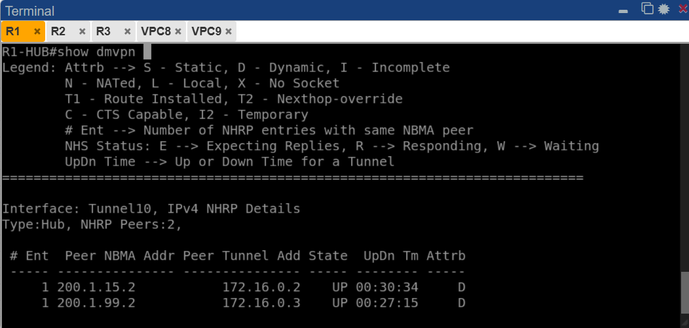

*IMAGEN2 — `show dmvpn` en R1-HUB. Se observan 2 peers dinámicos (atributo D) con estado UP:*
- *`200.1.15.2 → 172.16.0.2` (R2 Spoke1) — activo 00:30:34*
- *`200.1.99.2 → 172.16.0.3` (R3 Spoke2) — activo 00:27:15*

*Ambos Spokes están registrados correctamente en el Hub a través de NHRP.*

---

### Estado IKEv1 en R1 Hub

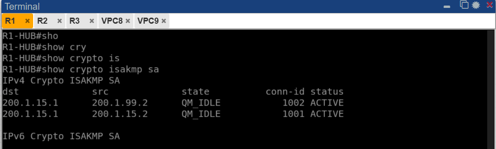

*IMAGEN3 — `show crypto isakmp sa` en R1-HUB. Se muestran dos sesiones IKEv1 en estado `QM_IDLE` (Quick Mode Idle = activo y estable):*
- *`200.1.99.2 → 200.1.15.1` — conn-id 1002 ACTIVE (R3 al Hub)*
- *`200.1.15.2 → 200.1.15.1` — conn-id 1001 ACTIVE (R2 al Hub)*

---

### Vecinos EIGRP en R1 Hub

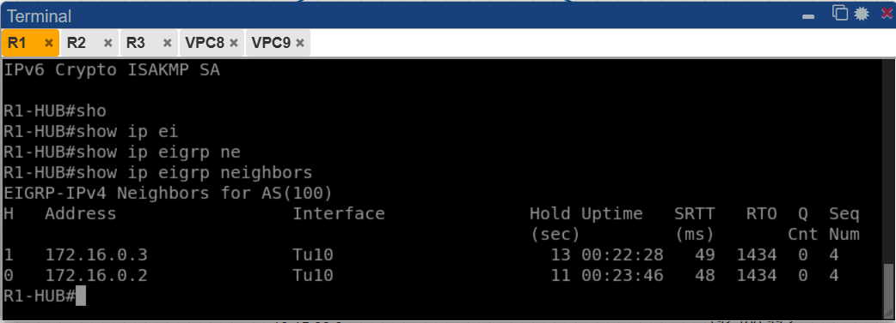

*IMAGEN4 — `show ip eigrp neighbors` en R1-HUB. EIGRP AS 100 ha formado adyacencias con ambos Spokes sobre Tunnel10:*
- *`172.16.0.3` (R3) — uptime 00:22:28*
- *`172.16.0.2` (R2) — uptime 00:23:46*

---

### Configuración Tunnel10 e interfaces en R1 Hub

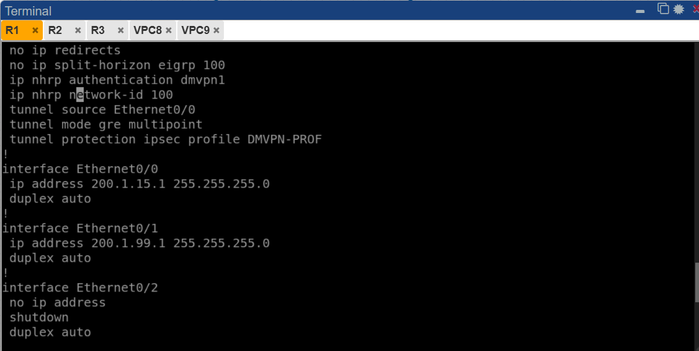

*IMAGEN5 — Extracto de `show run` en R1-HUB mostrando la configuración de Tunnel10: `no ip redirects`, autenticación NHRP, `tunnel mode gre multipoint` y protección IPSec con `DMVPN-PROF`. Se confirman también las IPs de e0/0 (200.1.15.1) y e0/1 (200.1.99.1).*

---

### EIGRP y rutas en R1 Hub

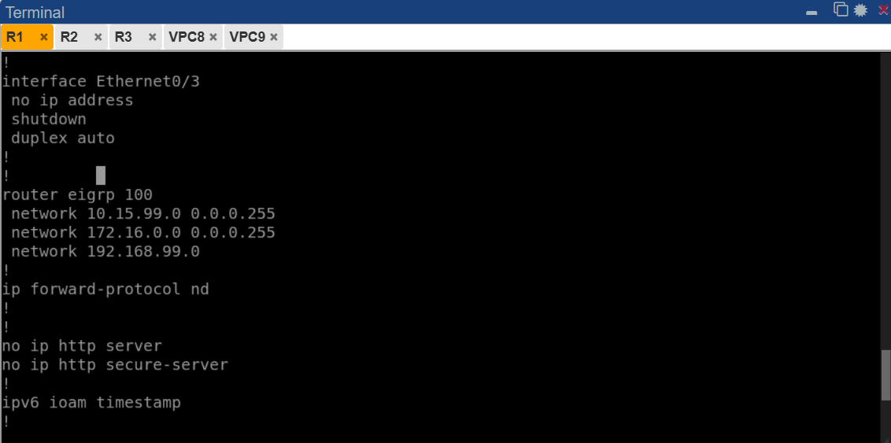

*IMAGEN6 — Extracto de `show run` en R1-HUB mostrando la configuración de `router eigrp 100` con las tres redes anunciadas: `10.15.99.0`, `172.16.0.0` y `192.168.99.0`.*

---

### Estado DMVPN en R2 Spoke1

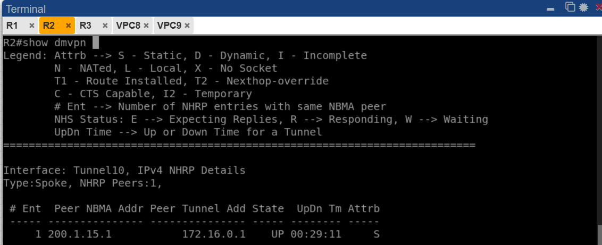

*IMAGEN7 — `show dmvpn` en R2. Tipo: Spoke con 1 peer. Muestra el Hub `200.1.15.1 → 172.16.0.1` con estado UP (atributo S = Static, entrada estática configurada en el Spoke).*

---

### Estado IKEv1 en R2 Spoke1

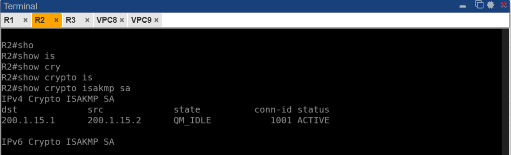

*IMAGEN8 — `show crypto isakmp sa` en R2. Sesión IKEv1 en estado `QM_IDLE` ACTIVE: `200.1.15.2 → 200.1.15.1` (R2 hacia el Hub). La negociación IKEv1 completada exitosamente.*

---

### Vecinos EIGRP en R2 Spoke1

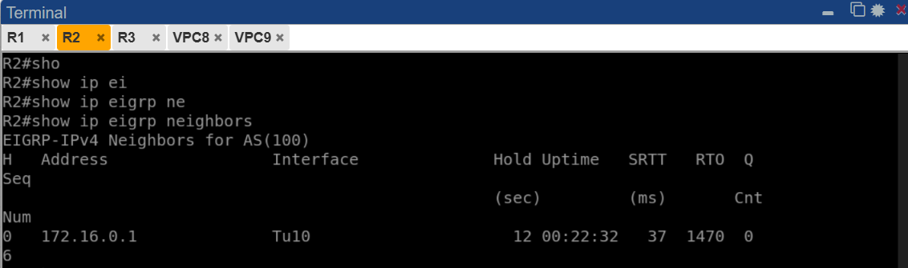

*IMAGEN9 — `show ip eigrp neighbors` en R2. EIGRP AS 100 ha formado adyacencia con el Hub `172.16.0.1` sobre `Tu10` (Tunnel10) con uptime 00:22:32.*

---

### Estado DMVPN en R3 Spoke2

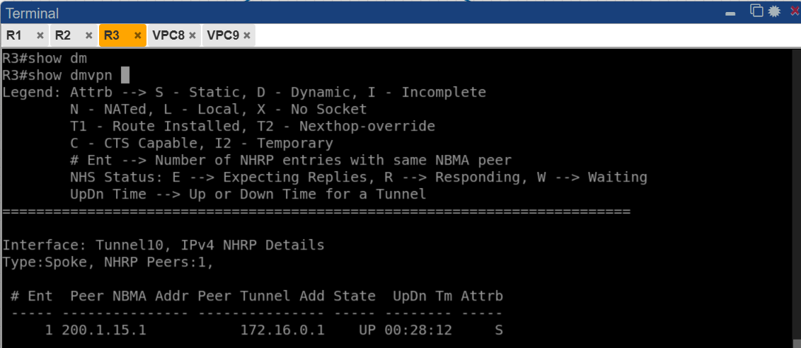

*IMAGEN10 — `show dmvpn` en R3. Tipo: Spoke con 1 peer. Hub `200.1.15.1 → 172.16.0.1` con estado UP (atributo S). R3 alcanza al Hub a través de su gateway `200.1.99.1`.*

---

### Estado IKEv1 en R3 Spoke2

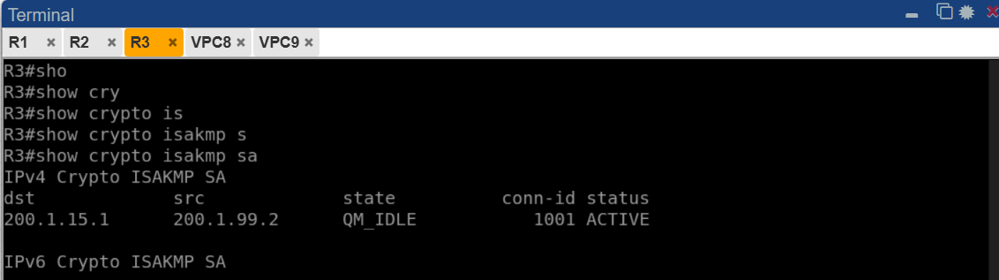

*IMAGEN11 — `show crypto isakmp sa` en R3. Sesión IKEv1 `QM_IDLE` ACTIVE: `200.1.99.2 → 200.1.15.1`. R3 se autentica con la IP NBMA del Hub (`200.1.15.1`), que es la fuente del Tunnel10.*

---

### Vecinos EIGRP en R3 Spoke2

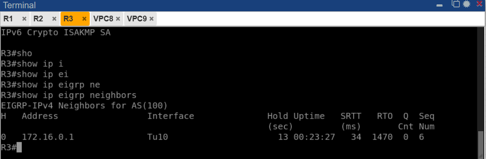

*IMAGEN12 — `show ip eigrp neighbors` en R3. EIGRP AS 100 formó adyacencia con el Hub `172.16.0.1` sobre `Tu10` con uptime 00:23:27.*

---

### Ping VPC8 → VPC9

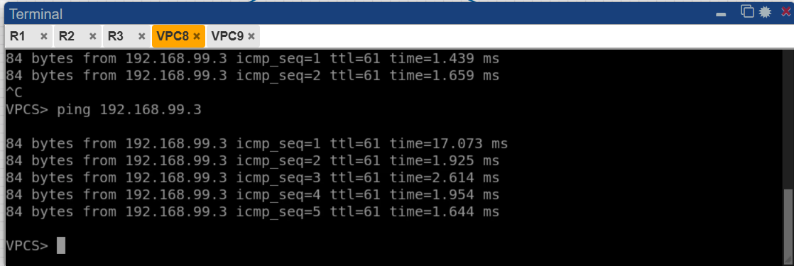

*IMAGEN13 — Ping desde VPC8 (`10.15.99.3`) hacia VPC9 (`192.168.99.3`). Resultado: 5/5 paquetes exitosos, latencia promedio ~2ms. El tráfico viaja cifrado por el túnel DMVPN entre Spoke1 (R2) y Spoke2 (R3).*

---

### Ping VPC9 → VPC8

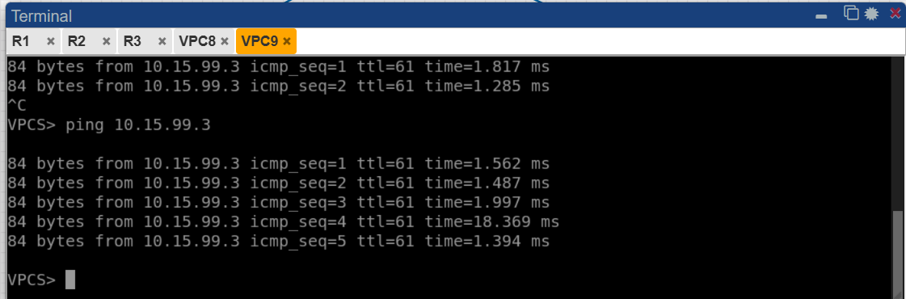

*IMAGEN14 — Ping desde VPC9 (`192.168.99.3`) hacia VPC8 (`10.15.99.3`). Resultado: 5/5 paquetes exitosos. Se confirma la conectividad bidireccional entre ambas LANs a través del DMVPN Fase 2 con IKEv1.*

---

## Resumen de verificación

| Verificación                        | Comando                        | Resultado esperado                    | Estado |
|-------------------------------------|--------------------------------|---------------------------------------|--------|
| Túneles NHRP Hub                    | `show dmvpn`                   | 2 peers UP (D = Dynamic)              | ✓      |
| Sesiones IKEv1 Hub                  | `show crypto isakmp sa`        | QM_IDLE ACTIVE (x2)                   | ✓      |
| Vecinos EIGRP Hub                   | `show ip eigrp neighbors`      | 172.16.0.2 y 172.16.0.3 en Tu10       | ✓      |
| Túnel NHRP R2                       | `show dmvpn`                   | Hub UP (S = Static)                   | ✓      |
| IKEv1 R2                            | `show crypto isakmp sa`        | QM_IDLE ACTIVE                        | ✓      |
| EIGRP R2                            | `show ip eigrp neighbors`      | 172.16.0.1 en Tu10                    | ✓      |
| Túnel NHRP R3                       | `show dmvpn`                   | Hub UP (S = Static)                   | ✓      |
| IKEv1 R3                            | `show crypto isakmp sa`        | QM_IDLE ACTIVE                        | ✓      |
| EIGRP R3                            | `show ip eigrp neighbors`      | 172.16.0.1 en Tu10                    | ✓      |
| Conectividad VPC8 → VPC9            | `ping 192.168.99.3`            | 5/5 exitosos                          | ✓      |
| Conectividad VPC9 → VPC8            | `ping 10.15.99.3`              | 5/5 exitosos                          | ✓      |

---

## Notas técnicas

- Los túneles Spoke-to-Spoke en Fase 2 se crean **bajo demanda** al primer paquete de tráfico. El primer ping puede mostrar latencia alta (~17ms) por la negociación inicial; los siguientes son normales (~2ms).
- El Hub **no debe resumir** rutas sobre Tunnel10 en Fase 2: los Spokes necesitan ver el next-hop real del Spoke destino para construir el túnel directo.
- `no ip split-horizon eigrp 100` en Tunnel10 del Hub es obligatorio para que EIGRP propague rutas entre Spokes.
- R3 usa `200.1.99.1` como gateway pero se registra en NHRP con la IP `200.1.15.1` (fuente del Tunnel10 del Hub), ya que R1 enruta internamente entre sus dos interfaces WAN.
